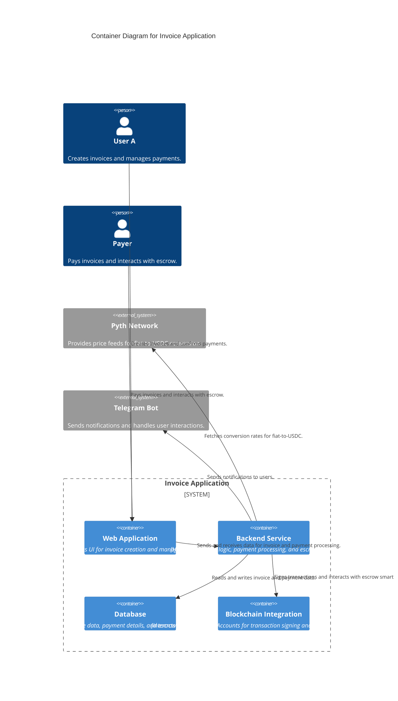

# PayxPay

## Table of Contents

- [PayxPay](#payxpay)
  - [Table of Contents](#table-of-contents)
  - [Overview](#overview)
  - [Motivation](#motivation)
  - [Architecture Diagram](#architecture-diagram)
  - [Project Breakdown](#project-breakdown)
  - [Project Highlights](#project-highlights)
  - [Getting Started](#getting-started)
- [PAYXPAY ENV VARS](#payxpay-env-vars)
- [UPSTASH](#upstash)
- [NEONDB DATABASE](#neondb-database)
  - [Technology Stack](#technology-stack)
  - [Deployed Contracts](#deployed-contracts)
  - [Conclusion](#conclusion)
  - [Team](#team)
  - [Demos](#demos)

## Overview

PayxPay is a decentralized payment application designed to facilitate microtransactions and peer-to-peer payments using fiat currencies and USDC. Built on the Xion Layer 1 blockchain, PayxPay leverages **Xion Meta Accounts** for transaction signing and **Pyth Network** for real-time fiat-to-USDC conversion. The app supports both direct payments and escrow-based payments, ensuring secure and transparent transactions.

Key features:

- **Invoice Creation**: Users can create invoices in fiat currencies (amount, currency, and description).
- **Shareable Links**: Invoices can be shared via QR codes, URLs, or Telegram.
- **USDC Payments**: Payments are made in USDC, with real-time conversion using Pyth Network price feeds.
- **Escrow System**: Payments can be held in escrow until both parties confirm the transaction.
- **Telegram Integration**: Notifications and interactions are handled via a Telegram bot and mini app.
- **Blockchain Transparency**: All transactions are verifiable on the Xion blockchain.

## Motivation

PayxPay was created to address the challenges faced by users in countries with volatile economies and restrictive financial policies. In such regions:

- **Currency Instability**: Fiat currencies often experience hyperinflation, making it difficult to conduct stable transactions.
- **Government Restrictions**: Many governments impose strict limitations on cryptocurrency trading and usage.
- **Microtransactions**: PayxPay enables small-scale transactions between individuals and businesses, bypassing traditional banking systems.

By providing a decentralized, transparent, and user-friendly payment system, PayxPay empowers users to conduct secure transactions without relying on unstable fiat currencies or restrictive financial systems.

## Architecture Diagram

Below is the high-level architecture of PayxPay:



## Project Breakdown

PayxPay consists of the following components:

1. **Frontend**: Built with **Next.js**, the frontend provides a user-friendly interface for creating and managing invoices.
2. **Backend**: Handles business logic, payment processing, and escrow management.
3. **Database**: Uses **PostgreSQL** to store invoice data, payment details, and escrow information.
4. **Blockchain Integration**: Interacts with **Xion Meta Accounts** for transaction signing and escrow smart contracts.
5. **Telegram Bot**: Sends notifications and handles user interactions via Telegram.
6. **Redis**: Used for caching and real-time data processing.

## Project Highlights

- **Real-Time Conversion**: Uses Pyth Network price feeds for accurate fiat-to-USDC conversion.
- **Escrow System**: Ensures secure payments by holding funds in escrow until both parties confirm the transaction.
- **Telegram Integration**: Provides seamless communication and notifications via Telegram.
- **Blockchain Transparency**: All transactions are recorded on the Xion blockchain for transparency and verification.

## Getting Started

To set up PayxPay locally, follow these steps:

1. **Clone the Repository**:

   ```bash
   git clone https://github.com/0xMaxyz/payxpay/tree/frontend
   cd payxpay
   ```

2. **Install Dependencies:**

   ```bash
   npm install
   ```

3. **Set Up Environment Variables:**

   Create a .env file and add the following variables:
   <details>
   <summary>Click to expand</summary>
   <pre>
   # PAYXPAY ENV VARS
   ARBITER_PK=
   BOT_TOKEN=
   NEXT_PUBLIC_CHAIN_ID="xion-testnet-1"
   NEXT_PUBLIC_CONTRACT=
   NEXT_PUBLIC_ENV="development"
   NEXT_PUBLIC_PRICE_FEED="https://hermes.pyth.network"
   NEXT_PUBLIC_TREASURY=
   NEXT_PUBLIC_XION_REST="https://api.xion-testnet-1.burnt.com"
   NEXT_PUBLIC_XION_RPC="https://rpc.xion-testnet-1.burnt.com:443"
   # UPSTASH
   KV_REST_API_READ_ONLY_TOKEN=
   KV_REST_API_TOKEN=
   KV_REST_API_URL=
   KV_URL=
   # NEONDB DATABASE
   DATABASE_URL=
   DATABASE_URL_UNPOOLED=
   PGDATABASE=
   PGHOST=
   PGHOST_UNPOOLED=
   PGPASSWORD=
   PGUSER=
   POSTGRES_DATABASE=
   POSTGRES_HOST=
   POSTGRES_PASSWORD=
   POSTGRES_PRISMA_URL=
   POSTGRES_URL=
   POSTGRES_URL_NON_POOLING=
   POSTGRES_URL_NO_SSL=
   POSTGRES_USER=
   </pre>
   </details>
   <br>

4. **Run the Application:**

   ```bash
   npm run dev
   ```

5. **Access the App:**

   Open your browser and navigate to <http://localhost:3000>.

## Technology Stack

- **Frontend/Backend**: Next.js
- **Database**: PostgreSQL (NeonDb)
- **Caching**: Redis (Upstash)
- **Blockchain**: Xion Layer1
- **Price Feeds**: Pyth Network
- **Telegram Integration**: Telegram Bot API, Telegram Mini App

## Deployed Contracts

- **Escrow Smart Contract**: [Contract Address](https://testnet.xion.explorers.guru/contract/xion1x6nzmspd9rprrh8xzql58gqa2yf4n8qpf2h3z8vsr229c0mgzzxsh90cz2) (Code id: 1769)

## Conclusion

PayxPay is a decentralized payment solution designed to address the challenges of unstable fiat currencies and restrictive financial systems. By leveraging blockchain technology and real-time price feeds, PayxPay provides a secure, transparent, and user-friendly platform for microtransactions and peer-to-peer payments.

## Team

- **[Max]**: Project Lead, Full-Stack Developer

## Demos

- **Live Demo**: [PayxPay Demo](#)
- **Screenshots**:
  - 
  - 
- **Video Walkthrough**: [YouTube Link](#)
